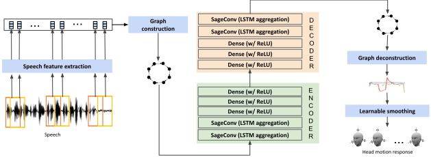
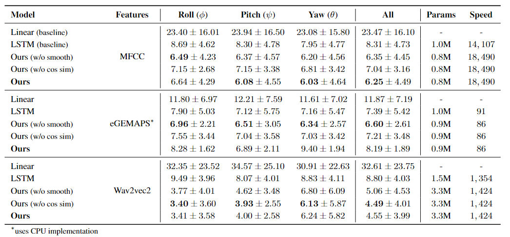
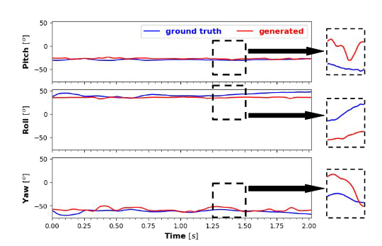

# Active Listener: Continuous Generation Of Listener’s Head Motion Response In Dyadic Interactions
[](https://github.com/bigzen/Active-Listener/stargazers)
[](https://github.com/bigzen/Active-Listener/network) 
[](https://github.com/bigzen/Active-Listener/blob/main/LICENSE) 


<br>


<br>


> **Abstract:** A key component of dyadic spoken interactions is the contextually relevant non-verbal gestures, such as head movements that reflect a listener's response to the interlocutor's speech. Although significant progress has been made in the context of generating co-speech gestures, generating listener's response has remained a challenge. We introduce the task of generating continuous head motion response of a listener in response to the speaker's speech in real time. To this end, we propose a graph-based end-to-end crossmodal model that takes interlocutor's speech audio as input and directly generates head pose angles (roll, pitch, yaw) of the listener in real time. Different from previous work, our approach is completely data-driven, does not require manual annotations or oversimplify head motion to merely nods and shakes. Extensive evaluation on the dyadic interaction sessions on the IEMOCAP dataset shows that our model produces a low overall error (4.5 degrees) and a high frame rate, thereby indicating its deployability in real-world human-robot interaction systems.


<p align="center">
  
  <br>
  <b>Figure 1</b>: Overall Architecture of GNN Active Listener model.
</p>

## Running the Code

 The code requires conda3 (or miniconda3), and one CUDA capable GPU. The instructions below guide you regarding running the codes in this repository. 

### Environment & Libraries

The full libraries list is provided as a `back.yml` in this repo. To create a virtual environment with requirements in `conda` run

~~~bash
(myenv) $ conda env create -f back.yml
~~~

### Dataset Preparation

The IEMOCAP dataset can be obtained from [USC](https://sail.usc.edu/iemocap/iemocap_release.htm). Once obtained store the dataset to the folder `./IEMOCAP_full_release` in the same parent directory as our repository. Copy the files inside the data folder to the Dataset directory.

Use the `process_data.ipynb` notebook to process the raw audio files, extract required features and save them in pickle (.pkl) format. Follow the instructions within the notebook to process and create various dataloaders for GNN/LSTM models with different features. 

### Training & Sampling

The notebooks are designed to perform 5-fold cross-validation and save the outputs of all the 5 validation sets.

Follow the instructions within the notebook `LSTM.ipynb` to train the LSTM model and save the outputs of validation sets.

Follow the instructions within the notebook `graph.ipynb` to train the GNN model and save the outputs of validation sets.

### Results and Statistics

Follow the instructions within the notebook `stats.ipynb` to compute the evaluation metrics on the saved data. It computes the metric for all outputs saved in results directory. This also outputs the resulting table in `.tex` format.

<p align="center">
  
  <br>
  <b>Table 1</b>: Performance of our proposed generalised (subject-independent) head motion response generation model for different feature sets. The results are presented in terms of MAE (mean ±standard deviation) across 5-fold cross validation. The speed indicates end-to-end generation speed in terms of fps.
</p>

<p align="center">
  
  <br>
  <b>Figure 2</b>: Visualisation of Active Listener model's generated output.
</p>

## Authors

* Paper Authors : Bishal Ghosh, Emma Li, Tanaya Guha

* Code Author : Bishal Ghosh

* Contact : b[dot]ghosh[dot]1[at]research[dot]gla[dot]ac[dot]uk


## Citation
If you find this repo useful, please cite our paper via
```bibtex
@article{------,
  title={Active Listener: Continuous Generation Of Listener’s Head Motion Response In Dyadic Interactions},
  author={Ghosh, Bishal and Li, Emma  and Guha, Tanaya},
  journal={arXiv preprint arXiv:----.-----},
  year={2024}
}
```
